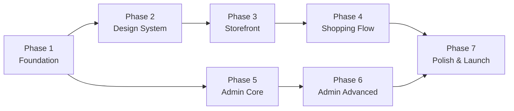

# Isha Vastram — Phased Execution Plan

> Detailed, expert-level execution guide for building the Isha Vastram saree e-commerce platform.  
> Each phase is self-contained with clear **actions**, **deliverables**, **desired outcomes**, and **expert tips**.

---

## Phase Overview

| # | Phase | What It Covers | Estimated Effort | Depends On |
|---|---|---|---|---|
| 1 | **Foundation & Infrastructure** | Next.js setup, Supabase, DB schema, auth, project structure | 🔧 Core | — |
| 2 | **Design System & Reusable UI** | CSS tokens, typography, all reusable components, layouts | 🎨 Design | Phase 1 |
| 3 | **Customer Storefront** | Homepage, Collection, Saree Detail pages (read-only, no cart yet) | 🏪 Frontend | Phase 2 |
| 4 | **Shopping Flow** | Cart context, Cart page, Checkout, WhatsApp integration | 🛒 E-commerce | Phase 3 |
| 5 | **Admin: Auth & Product Management** | Admin login, dashboard home, add/edit/delete sarees, image upload | 🔐 Admin Core | Phase 1 |
| 6 | **Admin: Orders, Customers & Finance** | Order management, customer list, messaging, revenue analytics | 📊 Admin Advanced | Phase 5 |
| 7 | **Polish, Testing & Launch** | Animations, responsive fixes, SEO, performance, deployment | 🚀 Launch | All |



> [!TIP]
> **Phases 3-4 (Customer) and Phases 5-6 (Admin) can run in parallel** since they share only the foundation and design system. This is the fastest path to a working product.

---

## Phase 1: Foundation & Infrastructure

### 🎯 Goal
Set up the entire project skeleton — Next.js, Supabase connection, database tables, auth system, and folder structure. After this phase, you have a running app with a working database and admin login.

### 📋 Actions (Step by Step)

#### Step 1.1 — Initialize Next.js Project
```bash
# Clear existing files (keep image.png)
# Initialize Next.js 14 with TypeScript + App Router
npx -y create-next-app@latest ./ --typescript --app --eslint --src-dir --no-tailwind --import-alias "@/*"
```
- Move `image.png` to `public/images/logo.png`
- Install dependencies: `npm install @supabase/supabase-js jsonwebtoken`
- Install dev deps: `npm install -D @types/jsonwebtoken`

#### Step 1.2 — Create `.env.local`
```env
NEXT_PUBLIC_SUPABASE_URL=https://your-project.supabase.co
NEXT_PUBLIC_SUPABASE_ANON_KEY=your-anon-key
SUPABASE_SERVICE_ROLE_KEY=your-service-role-key
ADMIN_PASSWORD=isha-admin-2026
JWT_SECRET=your-random-64-char-secret
ADMIN_WHATSAPP_NUMBER=919876543210
```

#### Step 1.3 — Create Supabase Client Helpers

**`src/lib/supabase/client.ts`** — Browser-side client (uses anon key, safe to expose)
```typescript
import { createClient } from '@supabase/supabase-js';

export const supabase = createClient(
  process.env.NEXT_PUBLIC_SUPABASE_URL!,
  process.env.NEXT_PUBLIC_SUPABASE_ANON_KEY!
);
```

**`src/lib/supabase/server.ts`** — Server-side client (uses service role key, full access)
```typescript
import { createClient } from '@supabase/supabase-js';

export const supabaseAdmin = createClient(
  process.env.NEXT_PUBLIC_SUPABASE_URL!,
  process.env.SUPABASE_SERVICE_ROLE_KEY!
);
```

> [!WARNING]
> **Never import `server.ts` in client components.** The service role key bypasses Row Level Security and has full database access. Only use it in API routes and server components.

#### Step 1.4 — Create SQL Migration & Run in Supabase

Create `supabase/migrations/001_initial_schema.sql` with all 4 tables:
- `products` — Saree catalog with images, tags, stock tracking
- `customers` — Customer profiles with order stats
- `orders` — Order records linked to customers via FK
- `order_items` — Individual items in each order (normalized)
- Plus: indexes, `updated_at` triggers

**How to run:** Open Supabase Dashboard → SQL Editor → paste → Run.

#### Step 1.5 — Create Supabase Storage Bucket
- Dashboard → Storage → New bucket → Name: `products` → **Public** ✅
- This gives CDN-backed URLs: `https://your-project.supabase.co/storage/v1/object/public/products/filename.jpg`

#### Step 1.6 — TypeScript Types (`src/types/database.ts`)
- Create interfaces matching every SQL table column exactly
- Use `snake_case` to match PostgreSQL conventions
- Include joined types (`Order` with optional `customer` and `items`)

#### Step 1.7 — Admin Auth System

**`src/lib/auth.ts`** — JWT-based admin authentication:
- `loginAdmin(password)` → validates against env → signs JWT → sets httpOnly cookie
- `verifyAdmin(request)` → reads cookie → verifies JWT → returns boolean
- Cookie name: `admin_token`, httpOnly, secure, sameSite strict

**`src/app/api/auth/login/route.ts`** — Login API endpoint:
- POST with `{ password }` body
- Returns JWT cookie if password matches

#### Step 1.8 — Create Folder Structure
Create all empty directories to establish the project skeleton.

### ✅ Desired Outcome

| Check | Criteria |
|---|---|
| ✅ | `npm run dev` starts without errors on `localhost:3000` |
| ✅ | Supabase connection works — can query empty `products` table |
| ✅ | All 4 DB tables exist with correct columns, FKs, and indexes |
| ✅ | Storage bucket `products` created and publicly accessible |
| ✅ | `POST /api/auth/login` with correct password returns JWT cookie |
| ✅ | `POST /api/auth/login` with wrong password returns 401 |
| ✅ | TypeScript types compile without errors (`npx tsc --noEmit`) |

### 💡 Expert Tips
- **Generate a strong JWT secret**: `node -e "console.log(require('crypto').randomBytes(64).toString('hex'))"`
- **Test Supabase connection early** — create a quick test API route that does `supabase.from('products').select('*')` and verify it returns `{ data: [], error: null }`
- **Don't skip indexes** — the `idx_orders_created` DESC index is critical for the admin dashboard's "recent orders" query performance

---

## Phase 2: Design System & Reusable UI Components

### 🎯 Goal
Build the complete visual foundation — CSS design tokens, typography, color palette, and all reusable UI components. After this phase, every building block needed for both the storefront and admin dashboard is ready.

### 📋 Actions (Step by Step)

#### Step 2.1 — Design System CSS (`src/app/globals.css`)

Create the entire CSS design system with variables:

```css
:root {
  /* Brand Colors — derived from the Isha Vastram logo */
  --color-maroon: #800020;
  --color-maroon-dark: #5C0017;
  --color-maroon-light: #A3274F;
  --color-gold: #D4A537;
  --color-gold-light: #F0D68A;
  --color-gold-dark: #B8891E;
  --color-cream: #FFF8F0;
  --color-cream-dark: #F5E6D0;
  --color-burgundy: #4A0E1B;
  --color-charcoal: #2D2D2D;
  
  /* Neutrals */
  --color-white: #FFFFFF;
  --color-gray-50: #FAFAFA;
  --color-gray-100: #F5F5F5;
  --color-gray-200: #E5E5E5;
  --color-gray-300: #D4D4D4;
  --color-gray-500: #737373;
  --color-gray-700: #404040;
  --color-gray-900: #171717;
  
  /* Status Colors */
  --color-success: #16A34A;
  --color-warning: #EAB308;
  --color-error: #DC2626;
  --color-info: #2563EB;
  
  /* Typography */
  --font-heading: 'Playfair Display', Georgia, serif;
  --font-body: 'Inter', -apple-system, sans-serif;
  
  /* Spacing Scale */
  --space-xs: 0.25rem;   /* 4px */
  --space-sm: 0.5rem;    /* 8px */
  --space-md: 1rem;      /* 16px */
  --space-lg: 1.5rem;    /* 24px */
  --space-xl: 2rem;      /* 32px */
  --space-2xl: 3rem;     /* 48px */
  --space-3xl: 4rem;     /* 64px */
  
  /* Border Radius */
  --radius-sm: 6px;
  --radius-md: 10px;
  --radius-lg: 16px;
  --radius-full: 9999px;
  
  /* Shadows */
  --shadow-sm: 0 1px 2px rgba(0,0,0,0.05);
  --shadow-md: 0 4px 12px rgba(0,0,0,0.1);
  --shadow-lg: 0 10px 40px rgba(0,0,0,0.15);
  --shadow-gold: 0 4px 20px rgba(212,165,55,0.3);
  
  /* Transitions */
  --transition-fast: 150ms ease;
  --transition-normal: 300ms ease;
  --transition-slow: 500ms ease;
  
  /* Z-index Scale */
  --z-dropdown: 100;
  --z-sticky: 200;
  --z-modal-backdrop: 300;
  --z-modal: 400;
  --z-toast: 500;
  --z-tooltip: 600;
}
```

Include:
- CSS reset / normalize
- Base typography styles (h1-h6, p, a)
- Utility classes (`.container`, `.section-padding`, `.text-center`, etc.)
- Keyframe animations (`fadeIn`, `slideUp`, `shimmer`, `float`, `pulse`)
- Responsive breakpoints via media queries

#### Step 2.2 — Root Layout (`src/app/layout.tsx`)
- Import Google Fonts (Playfair Display + Inter) via `next/font/google`
- Set HTML `lang="en"`, meta tags, favicon
- SEO metadata: title "Isha Vastram — Pure Cotton Sarees", description, Open Graph
- Wrap children in font classes

#### Step 2.3 — Reusable UI Components (`src/components/ui/`)

Build these **atomic components** that everything else is composed from:

| Component | What It Does | Key Features |
|---|---|---|
| **Button.tsx** | Primary, secondary, outline, ghost variants | Loading spinner state, ripple effect on click, size variants (sm/md/lg) |
| **Input.tsx** | Text input with label + error state | Floating label animation, error message slot, icon prefix support |
| **Modal.tsx** | Overlay dialog | Backdrop blur, slide-in animation, trap focus, close on Escape |
| **Toast.tsx** | Notification popup | Success/error/info variants, auto-dismiss timer, slide-in from right |
| **Badge.tsx** | Status labels | Color-coded (green=active, red=low stock, yellow=draft), pill shape |
| **Loader.tsx** | Loading states | Full-page spinner + inline skeleton shimmer variant |

#### Step 2.4 — Layout Components (`src/components/layout/`)

| Component | What It Does | Key Features |
|---|---|---|
| **Navbar.tsx** | Customer-facing top navigation | Logo (left), nav links (center: Home, Collection, About, Contact), cart icon with badge (right). Shrinks on scroll, glassmorphism blur, mobile hamburger menu |
| **Footer.tsx** | Site footer | 4-column grid: About, Quick Links, Contact Info, Social. WhatsApp CTA button. Copyright |
| **AdminSidebar.tsx** | Admin dashboard side navigation | Dark theme, logo at top, nav items with icons (Dashboard, Products, Orders, Customers, Finance), active state highlight, collapse on mobile |

### ✅ Desired Outcome

| Check | Criteria |
|---|---|
| ✅ | Homepage renders with correct fonts (Playfair Display + Inter) |
| ✅ | All CSS variables work — colors, spacing, shadows applied correctly |
| ✅ | All 6 UI components render correctly in isolation |
| ✅ | Navbar renders with logo, links, and cart icon with count badge |
| ✅ | Footer renders with 4-column layout, responsive on mobile |
| ✅ | AdminSidebar renders with dark theme and nav items |
| ✅ | All animations play smoothly (fadeIn, slideUp, shimmer) |
| ✅ | Responsive at 375px / 768px / 1440px — no overflow, no broken layouts |

### 💡 Expert Tips
- **Design the button first** — it's used everywhere. Get the hover, focus, active, disabled, and loading states perfect before moving on
- **Use `clamp()` for responsive typography**: `font-size: clamp(1.5rem, 4vw, 3rem)` scales headings beautifully without media queries
- **Navbar scroll effect**: Use `IntersectionObserver` on a sentinel div, not `scroll` event listener — much better performance
- **Test components in isolation**: Temporarily render each component on the homepage to verify before assembling pages

---

## Phase 3: Customer Storefront (Read-Only)

### 🎯 Goal
Build all customer-facing pages — the "wow" factor. Homepage with hero, featured sarees, categories. Collection page with filters. Saree detail page with image gallery. After this phase, a customer can browse the entire catalog beautifully — but can't buy yet (that's Phase 4).

### 📋 Actions (Step by Step)

#### Step 3.1 — Generate Hero Banner Images
Use AI image generation to create:
- A stunning hero banner (saree draped elegantly, maroon/gold tones)
- Category images (Cotton, Silk, Festive, Daily Wear)
- Store these in `public/images/banners/`

#### Step 3.2 — Homepage Components (`src/components/home/`)

**HeroSection.tsx** — The first thing customers see
- Full-viewport height (100vh), background image with parallax CSS
- Overlaid text: logo, Marathi tagline "शुद्ध कापसाच्या साड्यांचे विशेष घर"
- CTA button "Explore Collection" → links to `/collection`
- Subtle floating/draping CSS animation on the saree image
- **Expert move**: Use `background-attachment: fixed` for simple parallax, or `transform: translateY()` on scroll for smoother parallax

**FeaturedSarees.tsx** — Horizontal carousel
- Fetch featured products from API: `GET /api/products?featured=true`
- Render as horizontal scrollable container with CSS `scroll-snap`
- Each card has 3D tilt effect on hover (CSS `perspective` + `rotateY`)
- "View All" link at the end

**Categories.tsx** — Grid of category cards
- 2×2 grid on desktop, stack on mobile
- Each card: category image, overlay gradient, category name
- On hover: overlay slides up revealing "Shop Now" CTA
- Links to `/collection?category=cotton`, etc.

**WhyChooseUs.tsx** — USP section
- 4 animated icon cards: Pure Cotton, Handloom Craft, Affordable Prices, Fast Delivery
- Icons animate on scroll into view (CSS `animation-play-state` + IntersectionObserver)

**Testimonials.tsx** — Social proof
- Auto-scrolling carousel of customer reviews
- Star ratings, customer name, review text
- Pause on hover, continuous loop

#### Step 3.3 — Homepage Assembly (`src/app/page.tsx`)
- Server component that fetches featured products from Supabase
- Renders: Hero → Featured → Categories → WhyChooseUs → Testimonials
- Floating WhatsApp button (fixed position, bottom-right)

#### Step 3.4 — Products API Routes

**`src/app/api/products/route.ts`** — GET (list) + POST (create)
```typescript
// GET: Public — list active products with optional filters
// Query params: ?category=cotton&minPrice=500&maxPrice=2000&sort=price_asc&page=1
const { data } = await supabase
  .from('products')
  .select('*')
  .eq('status', 'active')
  .order('created_at', { ascending: false });
```

**`src/app/api/products/[id]/route.ts`** — GET (single) + PUT + DELETE

#### Step 3.5 — Collection Page (`src/app/collection/page.tsx`)

- **FilterSidebar.tsx**: Category checkboxes, price range slider (min/max), color swatches, "In Stock Only" toggle
- **SareeGrid.tsx**: Responsive CSS Grid — 2 cols (mobile) / 3 cols (tablet) / 4 cols (desktop)
- **SareeCard.tsx**: Product card with:
  - Image with zoom on hover (CSS `transform: scale(1.1)`)
  - Golden border glow on hover (`box-shadow: var(--shadow-gold)`)
  - Name, price (with strikethrough if `compare_price` exists)
  - "Add to Cart" button (disabled for now, enabled in Phase 4)
  - Skeleton shimmer loading state
- URL-synced filters: `/collection?category=cotton&sort=price_asc`
- "Load More" button for pagination (not infinite scroll — better UX for e-commerce)

#### Step 3.6 — Saree Detail Page (`src/app/saree/[id]/page.tsx`)

- **ImageGallery.tsx**: Main image (large) + thumbnail strip below. Click thumbnail to switch main image. Zoom on hover (CSS `overflow: hidden` + scaled inner image following cursor)
- Product info: Name, price, compare price with "X% OFF" badge, description, category, tags as chips
- Quantity selector (+ / −)
- "Add to Cart" button (wired in Phase 4)
- "Ask about this saree on WhatsApp" button → `wa.me/{adminNumber}?text=Hi, I'm interested in {saree name}`
- Related sarees section below (same category, different products)

#### Step 3.7 — About & Contact Pages
- **About page**: Brand story, mission, handloom tradition, team
- **Contact page**: Form (name, phone, message), address, map embed, WhatsApp link

### ✅ Desired Outcome

| Check | Criteria |
|---|---|
| ✅ | Homepage loads with hero, featured sarees (from DB), categories, testimonials |
| ✅ | Hero section has parallax effect and CTA button navigates to `/collection` |
| ✅ | Collection page shows all active sarees from database in responsive grid |
| ✅ | Filters (category, price, sort) work and update URL params |
| ✅ | Saree cards have hover effects (zoom, glow, smooth transitions) |
| ✅ | Saree detail page shows image gallery, product info, related sarees |
| ✅ | WhatsApp inquiry button opens correct `wa.me` link with pre-filled message |
| ✅ | All pages are responsive (375px / 768px / 1440px) |
| ✅ | Loading states show skeleton shimmers while data fetches |
| ✅ | Floating WhatsApp button visible on all pages |

### 💡 Expert Tips
- **Seed the database first**: Before building UI, insert 8-10 sample sarees into `products` table via Supabase Dashboard so you have real data to display
- **Image optimization**: Use Next.js `<Image>` component with `fill` prop and `sizes` attribute for automatic responsive images
- **Skeleton loading**: Match skeleton dimensions exactly to final content — mismatched sizes cause layout shift (poor CLS score)
- **URL-synced filters** are crucial for e-commerce SEO — `/collection?category=cotton` can be shared and indexed by Google

---

## Phase 4: Shopping Flow (Cart → Checkout → WhatsApp)

### 🎯 Goal
Build the complete purchase flow — Cart context for state management, Cart page for review, Checkout page with customer form, and WhatsApp order notification. After this phase, a customer can buy a saree end-to-end.

### 📋 Actions (Step by Step)

#### Step 4.1 — Cart Context (`src/context/CartContext.tsx`)

React Context + useReducer for global cart state:

```typescript
interface CartItem {
  productId: string;
  name: string;
  price: number;
  image: string;
  quantity: number;
}

interface CartState {
  items: CartItem[];
  totalItems: number;
  subtotal: number;
}

// Actions: ADD_TO_CART, REMOVE_FROM_CART, UPDATE_QUANTITY, CLEAR_CART
```

- Persist cart to `localStorage` so it survives page refreshes
- Provide via `CartProvider` wrapping the root layout
- Export `useCart()` hook for easy access

#### Step 4.2 — Wire "Add to Cart" Everywhere
- Update `SareeCard.tsx`: "Add to Cart" button → calls `addToCart()` with product data
- Update saree detail page: "Add to Cart" button with quantity
- Add micro-animation: button ripple + cart icon bounces + toast notification "Added to cart!"
- Update Navbar cart icon: show item count from `useCart().totalItems`

#### Step 4.3 — Cart Page (`src/app/cart/page.tsx`)

- **CartItem.tsx**: Product image, name, price, quantity controls (+ / −), remove button
- Remove item with smooth slide-out animation
- **CartSummary.tsx**: Subtotal, shipping (flat ₹99 or free above ₹999), total
- Empty cart state with illustration and "Continue Shopping" CTA
- "Proceed to Checkout" button → navigates to `/checkout`

#### Step 4.4 — Checkout Page (`src/app/checkout/page.tsx`)

Two-column layout:
- **Left**: Customer info form
  - Name (required), Phone (required, Indian format validation), Email (optional)
  - Address (required), City (required), Pincode (required, 6-digit validation)
  - Form validation with inline error messages
- **Right**: Order summary (read-only cart items, subtotal, shipping, total)
- "Place Order" button → calls `POST /api/orders`

#### Step 4.5 — Order API (`src/app/api/orders/route.ts`)

POST handler — the most critical API route:

```
1. Validate all fields (name, phone, address, items)
2. Upsert customer (find by phone, update or create)
3. Generate orderId: "IV-" + date + "-" + sequential number
4. Create order record in `orders` table
5. Create order_items records for each cart item
6. Decrement product stock: UPDATE products SET stock = stock - quantity, sold = sold + quantity
7. Update customer stats: total_orders++, total_spent += total
8. Return { orderId, whatsappUrl } to redirect customer
```

> [!CAUTION]
> **Stock validation**: Before creating the order, verify each item still has sufficient stock. If a product is out of stock between cart and checkout, return an error. This prevents overselling.

#### Step 4.6 — WhatsApp Integration (`src/lib/whatsapp.ts`)

Build two WhatsApp URL generators:

**For Admin** (order notification):
```
https://wa.me/919876543210?text=🆕 New Order - Isha Vastram!%0A%0A📦 Order: IV-20260917-001%0A👤 Priya Sharma%0A📱 +91 98765 43210%0A📍 123, MG Road, Pune%0A%0A🛒 Items:%0A1. Banarasi Silk × 1 — ₹2,499%0A%0A💰 Total: ₹2,499
```

**For Customer** (order confirmation):
```
https://wa.me/919876543210?text=Hi! I just placed order IV-20260917-001 on Isha Vastram. Please confirm.
```

#### Step 4.7 — Order Confirmation Page
- After successful checkout, show: ✅ "Order Placed Successfully!"
- Display order ID, estimated delivery, items summary
- Two buttons: "Message Us on WhatsApp" + "Continue Shopping"
- Auto-open admin WhatsApp notification in new tab

### ✅ Desired Outcome

| Check | Criteria |
|---|---|
| ✅ | Cart persists across page navigations and browser refresh |
| ✅ | "Add to Cart" from both card and detail page works with animation |
| ✅ | Navbar cart icon shows correct count, updates live |
| ✅ | Cart page: quantity adjustment, remove item, totals are correct |
| ✅ | Checkout form validates all required fields with inline errors |
| ✅ | "Place Order" creates order in DB, decrements stock, updates customer |
| ✅ | WhatsApp message opens with correct order details (admin + customer) |
| ✅ | Order confirmation page shows order ID and next steps |
| ✅ | Out-of-stock products cannot be ordered (validation works) |

### 💡 Expert Tips
- **localStorage sync**: Use `window.addEventListener('storage')` to sync cart across tabs
- **Phone validation**: Indian mobile numbers are 10 digits starting with 6-9. Regex: `/^[6-9]\d{9}$/`
- **WhatsApp URL encoding**: Use `encodeURIComponent()` for the message text, and `%0A` for line breaks
- **Optimistic UI**: Show "Order Placed" immediately, then validate in background — don't make the user wait for the DB write

---

## Phase 5: Admin — Auth & Product Management

### 🎯 Goal
Build the admin login, dashboard home page with stats, and complete product management (CRUD + image upload). After this phase, the admin can log in, see business overview, and manage the entire saree catalog.

### 📋 Actions (Step by Step)

#### Step 5.1 — Admin Login Page (`src/app/admin/login/page.tsx`)
- Centered card with Isha Vastram logo
- Single password field + "Login" button
- Error toast on wrong password
- On success: set JWT cookie → redirect to `/admin`
- Maroon gradient background with subtle pattern

#### Step 5.2 — Admin Auth Middleware
- **`src/lib/auth.ts`**: `verifyAdmin(request)` function
  - Reads `admin_token` cookie → verifies JWT → returns `true/false`
- **`src/app/admin/layout.tsx`**: Server component that checks auth
  - If not authenticated → redirect to `/admin/login`
  - If authenticated → render AdminSidebar + children

#### Step 5.3 — Admin Layout (`src/app/admin/layout.tsx`)
- Dark theme (charcoal background `#1A1A2E`, sidebar `#16213E`)
- AdminSidebar on left (250px width)
- Content area on right with padding
- Mobile: sidebar becomes slide-out drawer with hamburger toggle
- Header bar with admin avatar, "Logout" button

#### Step 5.4 — Dashboard Home (`src/app/admin/page.tsx`)

**Stats Cards** (top row, 4 cards):
```sql
-- Total Revenue
SELECT COALESCE(SUM(total), 0) FROM orders WHERE status != 'cancelled';

-- Orders Today
SELECT COUNT(*) FROM orders WHERE created_at::date = CURRENT_DATE;

-- Total Products
SELECT COUNT(*) FROM products WHERE status = 'active';

-- Low Stock Alerts
SELECT COUNT(*) FROM products WHERE stock < 5 AND status = 'active';
```

Each card: icon, label, value, percentage change indicator (↑ green / ↓ red)

**Recent Orders** table: Last 10 orders with status badges
**Quick Actions**: "Add New Saree" button, "View All Orders" link

#### Step 5.5 — Product List (`src/app/admin/products/page.tsx`)
- Table with columns: Image (thumbnail), Name, Price (₹), Stock, Status (badge), Actions
- Actions: Edit (pencil icon), Delete (trash icon with confirmation modal)
- Search bar to filter by name
- "Add New Saree" button → navigates to `/admin/products/new`
- Low stock items highlighted with red row background

#### Step 5.6 — Add/Edit Saree Form (`src/app/admin/products/new/page.tsx`)

**ProductForm.tsx** — The core admin form:

- **Image Upload Zone**:
  - Drag & drop area + "Click to browse" fallback
  - Multiple image support (up to 5)
  - Preview thumbnails with remove (×) button
  - Upload to Supabase Storage: `supabase.storage.from('products').upload(path, file)`
  - Get public URL: `supabase.storage.from('products').getPublicUrl(path)`
  - Show upload progress indicator

- **Form Fields**:
  | Field | Type | Validation |
  |---|---|---|
  | Name | Text input | Required, min 3 chars |
  | Description | Textarea (multi-line) | Required |
  | Price (₹) | Number input | Required, min 1 |
  | Compare Price (₹) | Number input | Optional, must be > Price |
  | Stock Quantity | Number input | Required, min 0 |
  | Category | Dropdown | Cotton, Silk, Banarasi, Paithani, Chanderi, Tussar, Handloom |
  | Tags | Multi-select chips | Click to toggle: Festive, Bridal, Daily Wear, Party, Office, Wedding |
  | Color | Color picker / predefined swatches | Red, Blue, Green, Gold, Maroon, Pink, White, Black, Orange, Purple |
  | Status | Toggle | Active / Draft |
  | Featured | Checkbox | Show on homepage carousel |

- **Live Preview Card**: On the right side, show how the saree will appear on the storefront in real-time as the admin fills the form

- **Submit**: `POST /api/products` (new) or `PUT /api/products/[id]` (edit)

#### Step 5.7 — Image Upload API (`src/app/api/upload/route.ts`)
```typescript
// Accept multipart form data
// Generate unique filename: `${uuid}_${timestamp}.${ext}`
// Upload to Supabase Storage
// Return public URL
```

### ✅ Desired Outcome

| Check | Criteria |
|---|---|
| ✅ | `/admin` redirects to `/admin/login` when not authenticated |
| ✅ | Login with correct password → JWT cookie set → redirected to dashboard |
| ✅ | Dashboard shows 4 real-time stats from database |
| ✅ | Recent orders table shows last 10 orders |
| ✅ | Product list shows all sarees with images, price, stock, status |
| ✅ | "Add New Saree" form uploads images to Supabase Storage successfully |
| ✅ | Live preview card updates as form is filled |
| ✅ | New saree appears on customer-facing collection page after saving |
| ✅ | Edit saree pre-populates all fields including images |
| ✅ | Delete saree shows confirmation modal, removes from DB + Storage |

### 💡 Expert Tips
- **Image compression**: Before upload, compress images client-side using `canvas.toBlob()` — keep under 500KB for fast page loads
- **Unique filenames**: Use `crypto.randomUUID()` prefix to avoid collisions: `a1b2c3d4_banarasi-silk.jpg`
- **Form state**: Use React `useState` for each field, not `FormData` — gives you real-time preview capability
- **Optimistic stock count**: The "Low Stock" stat should consider items currently in active (unpaid) carts to avoid overselling

---

## Phase 6: Admin — Orders, Customers & Finance

### 🎯 Goal
Build the remaining admin modules — order management with status workflow, customer directory with WhatsApp messaging, and financial analytics dashboard. After this phase, the admin has full business control.

### 📋 Actions (Step by Step)

#### Step 6.1 — Orders Management (`src/app/admin/orders/page.tsx`)

**OrderTable.tsx** — Full orders data table:
- Columns: Order ID, Customer Name, Items (count), Total (₹), Status (badge), Date, Actions
- Click row → expand to show full order details (items, customer address, notes)
- **Status Workflow** dropdown:
  ```
  Received → Confirmed → Shipped → Delivered
                                  ↗ Cancelled (from any state)
  ```
  - Changing status calls `PUT /api/orders/[id]` → updates DB
  - Color-coded status badges: Received (blue), Confirmed (yellow), Shipped (orange), Delivered (green), Cancelled (red)
- **"Send WhatsApp"** button per order → opens `wa.me/{customer_phone}?text=Your order {orderId} has been {status}`
- **Filters**: Status dropdown, date range picker
- **Sort**: By date (newest first), by total, by status

#### Step 6.2 — Orders API Updates
- `GET /api/orders` — return orders joined with customer + items:
  ```typescript
  supabase.from('orders')
    .select('*, customer:customers(*), items:order_items(*)')
    .order('created_at', { ascending: false });
  ```
- `PUT /api/orders/[id]` — update status, set `whatsapp_sent` flag

#### Step 6.3 — Customer Management (`src/app/admin/customers/page.tsx`)

**CustomerTable.tsx**:
- Columns: Name, Phone, Email, Total Orders, Total Spent (₹), Last Order, Actions
- Sort by: Total Spent (highest first), Recent, Name
- Search by name or phone
- **Actions per customer**:
  - 📱 "WhatsApp" → opens `wa.me/{phone}` with message template selector
  - 📋 "View Orders" → filters orders page by this customer
- **Message Templates** (modal popup):
  - "Hi {name}! Your order is confirmed ✅"
  - "Hi {name}! Your order has been shipped 🚚"
  - "Hi {name}! Check out our new collection 🎉"
  - Custom message input
- **Export CSV** button → downloads customer list as CSV file

#### Step 6.4 — Customer API
- `GET /api/customers` — list all with sorting and search
- Build CSV export on the client side using `Blob` + `URL.createObjectURL`

#### Step 6.5 — Finance Dashboard (`src/app/admin/finance/page.tsx`)

**Revenue Overview** (top stats):
```sql
-- Today's Revenue
SELECT COALESCE(SUM(total), 0) FROM orders 
WHERE created_at::date = CURRENT_DATE AND status != 'cancelled';

-- This Week
WHERE created_at >= date_trunc('week', CURRENT_DATE)

-- This Month
WHERE created_at >= date_trunc('month', CURRENT_DATE)

-- All Time
WHERE status != 'cancelled'
```

**RevenueChart.tsx** — Line chart (pure CSS/SVG, no chart library):
- X-axis: dates (last 7 days / 30 days toggle)
- Y-axis: revenue in ₹
- Smooth line with gradient fill below
- Animated draw-in on mount
- Tooltip on hover showing exact value

**Sold Items Log** — Table:
- Join `order_items` with `orders` → show product name, quantity sold, price, customer name, date
- Filter by date range
- Total at bottom

**Stock Value** — Inventory summary:
- `SUM(price * stock)` across all active products
- List of products sorted by stock level (ascending)
- Low stock (< 5) highlighted in red with ⚠️ icon
- Out of stock (0) highlighted in dark red

**Order Status Breakdown** — Donut/Pie chart:
- Pure CSS donut chart using `conic-gradient`
- Shows percentage of orders in each status
- Legend with counts

### ✅ Desired Outcome

| Check | Criteria |
|---|---|
| ✅ | Orders page shows all orders with expandable detail rows |
| ✅ | Status dropdown changes order status in DB and updates badge |
| ✅ | WhatsApp button on each order opens correct message |
| ✅ | Customers page lists all customers with order stats |
| ✅ | WhatsApp message templates work (pre-fill with customer name) |
| ✅ | CSV export downloads correctly formatted file |
| ✅ | Finance: revenue stats show correct totals from DB |
| ✅ | Revenue chart renders with real data, toggles between 7/30 days |
| ✅ | Stock overview shows low-stock warnings |
| ✅ | Order status pie chart renders with correct percentages |

### 💡 Expert Tips
- **CSS-only charts**: Use `conic-gradient` for pie charts and SVG `<polyline>` for line charts — no need for heavyweight libraries like Chart.js for these simple visualizations
- **WhatsApp pre-fill**: Always `encodeURIComponent()` the message. Test with special characters (₹, emojis) — they need proper encoding
- **CSV generation**: Use `\uFEFF` BOM prefix for Excel compatibility with Unicode characters (₹, Hindi text)
- **Batch status updates**: Later, add checkbox selection + "Mark all as Shipped" bulk action

---

## Phase 7: Polish, Testing & Launch

### 🎯 Goal
Add all the micro-interactions, animations, responsive refinements, SEO optimization, and performance tuning that transform this from "working" to "wow". Then deploy.

### 📋 Actions (Step by Step)

#### Step 7.1 — Animations & Micro-Interactions

| Element | Animation | Implementation |
|---|---|---|
| Page load | Staggered fade-in of sections | CSS `animation-delay` + `@keyframes fadeInUp` |
| Navbar | Shrink + glassmorphism on scroll | `IntersectionObserver` toggling CSS class |
| Saree cards | 3D tilt on hover | CSS `perspective: 1000px` + `transform: rotateY(5deg)` |
| Saree cards | Golden border glow | `box-shadow` transition on hover |
| Add to Cart | Button ripple + cart bounce | CSS `::after` pseudo-element ripple + keyframe bounce |
| Cart icon | Item count badge pulse | CSS `@keyframes pulse` on count change |
| Remove from cart | Slide-out left | CSS `transform: translateX(-100%)` + `opacity: 0` |
| Toast | Slide-in from right | `@keyframes slideInRight` + auto-dismiss timer |
| WhatsApp FAB | Pulse ring + bounce | `@keyframes pulse-ring` with `box-shadow` |
| Admin charts | Draw-in | SVG `stroke-dashoffset` animation |
| Skeleton loading | Shimmer effect | `@keyframes shimmer` with gradient `background-position` |
| Category cards | Overlay reveal | `transform: translateY(100%)` → `translateY(0)` on hover |

#### Step 7.2 — Responsive Refinements
- Test every page at: **375px** (iPhone SE), **390px** (iPhone 14), **768px** (iPad), **1024px** (iPad landscape), **1440px** (desktop)
- Fix: font sizes, grid columns, padding, image aspect ratios, touch targets (min 44×44px)
- Mobile navbar: hamburger → slide-out drawer
- Mobile admin: sidebar collapses to bottom tab bar or hamburger drawer
- Mobile collection: 2-column grid with smaller cards
- Mobile checkout: single-column stacked layout

#### Step 7.3 — SEO Optimization
- **Every page** has unique `<title>` and `<meta description>`
- **Saree detail pages**: Dynamic metadata from product data
- **Structured data**: JSON-LD `Product` schema for each saree (helps Google Shopping)
- **Sitemap**: `next-sitemap` package for auto-generated sitemap.xml
- **Open Graph**: og:image for social sharing (saree product image)
- **Semantic HTML**: proper heading hierarchy (single h1 per page)

#### Step 7.4 — Performance Optimization
- **Images**: Next.js `<Image>` with `priority` on hero, `loading="lazy"` everywhere else
- **Code splitting**: Dynamic imports for heavy components (ImageGallery, Charts)
- **Bundle analysis**: `npm run build` → check for oversized chunks
- **Lighthouse audit**: Target scores: Performance 90+, Accessibility 95+, SEO 100

#### Step 7.5 — Error Handling & Edge Cases
- Empty states: No products, no orders, empty cart — all with helpful messaging
- 404 page: Custom branded not-found page
- Error boundaries: Graceful error UI instead of white screen
- Loading states: Every data fetch has a skeleton/spinner
- Network errors: Toast with "Something went wrong, try again"

#### Step 7.6 — Final Testing Checklist

**Customer Flow:**
- [ ] Homepage → Browse collection → Filter by category → View saree detail
- [ ] Add to cart → Adjust quantity → Remove item → Cart total correct
- [ ] Checkout → Fill form → Validate errors → Place order
- [ ] WhatsApp opens with correct order details
- [ ] Order confirmation shows order ID

**Admin Flow:**
- [ ] Login → Dashboard stats match DB
- [ ] Add new saree with images → appears on storefront
- [ ] Edit saree → changes reflected
- [ ] Delete saree → removed from storefront
- [ ] View orders → change status → WhatsApp notification
- [ ] View customers → send WhatsApp message
- [ ] Finance → revenue chart, stock overview, sold items

**Cross-Browser:**
- [ ] Chrome, Safari, Firefox (latest)
- [ ] Mobile Safari (iOS), Chrome (Android)

#### Step 7.7 — Deployment
- Deploy to **Vercel** (free tier, perfect for Next.js):
  ```bash
  npx vercel --prod
  ```
- Set environment variables in Vercel Dashboard → Settings → Environment Variables
- Configure custom domain (if available)
- Verify all functionality on production URL

### ✅ Desired Outcome

| Check | Criteria |
|---|---|
| ✅ | All animations play smoothly at 60fps, no jank |
| ✅ | Fully responsive on all breakpoints — no horizontal scroll, no truncated text |
| ✅ | Lighthouse: Performance 90+, Accessibility 95+, SEO 100 |
| ✅ | All empty states, error states, and loading states handled |
| ✅ | Customer can complete full purchase flow on mobile |
| ✅ | Admin can manage products, orders, customers on desktop |
| ✅ | WhatsApp messages arrive with correct formatting and data |
| ✅ | Deployed to Vercel/production and working end-to-end |

### 💡 Expert Tips
- **Performance**: The biggest bottleneck will be product images. Ensure Supabase Storage serves WebP format and use `srcset` with multiple sizes
- **Accessibility**: Don't just check the Lighthouse score — actually tab through the site with keyboard and use VoiceOver to verify screen reader experience
- **Launch checklist**: Test the WhatsApp integration with the real admin phone number before going live
- **Post-launch**: Monitor Supabase Dashboard for slow queries and high storage usage

---

## Summary: Files Created Per Phase

| Phase | Key Files Created | Count |
|---|---|---|
| **1** | Next.js config, `.env.local`, Supabase clients, SQL migration, types, auth | ~8 files |
| **2** | `globals.css`, `layout.tsx`, 6 UI components, 3 layout components | ~10 files |
| **3** | 5 homepage components, Products API (2), Collection page, Detail page, About, Contact | ~13 files |
| **4** | CartContext, CartItem, CartSummary, Checkout page, Orders API, WhatsApp helper | ~8 files |
| **5** | Admin login, admin layout, dashboard, ProductForm, product list, upload API | ~8 files |
| **6** | OrderTable, CustomerTable, Finance page, RevenueChart, Orders/Customers API updates | ~7 files |
| **7** | Animations CSS, 404 page, error boundary, sitemap config | ~4 files |
| **Total** | | **~58 files** |
